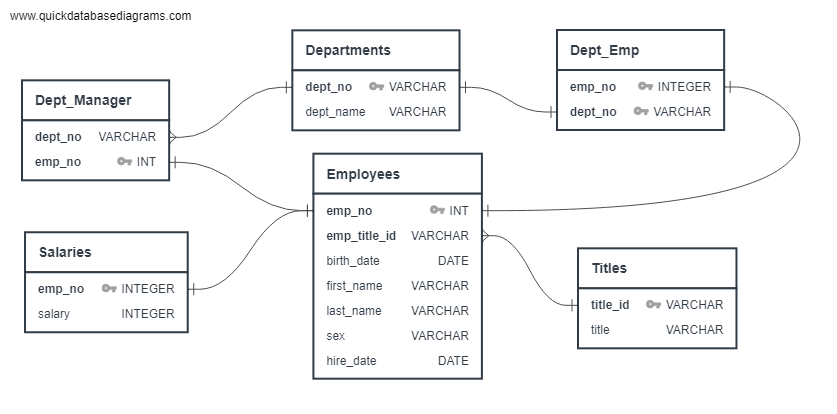

# SQL-Challenge - Employee Database: A Mystery in Two Parts

For this challenge, I was presented with a set of tables in CSV format which my employer requested I import for manipulation. 

## 💹Data Engineering:
The first objective was to review the information and determine how each table was related to the others and also to determine primary, foreign, and composite keys where needed. For this I needed to build an ERD.

## 🔬Data Analysis:
Once this was complete, I was ready to build the tables and import the data for analysis!

The second part of this challenge was the Data Analysis to answer all of my employer's questions. I was able to pull out specific data such as one year of employee's hire dates and all of the employees named Hercules. Additionally, I was able to join tables and to create a view for further manipulation of the data. 

## 💥One employee with the name Foolsday. Really?

It was at this point that I realized I had been fed a set of fake data and was being tested so I decided to really prove my skills. I read the data into Pandas and using Matplotlib I was able to create a couple nice visuals for my new employer.

### The first: a histogram of employee salaries. 

### The second: a bar chart of the average salary for each job title.

## 🎆 Epilogue: 
Alright, I admit that I did enjoy putting on a few finishing touches to prove my caliber. When I presented all of this information to my new boss she had a surprise I hadn't considered. She suggested I check my own employee number... 499942. Apparently, I am the fool... "April Foolsday"!! 

Contact:

* https://www.linkedin.com/in/sharon-colson
* sharon.colson@gmail.com
